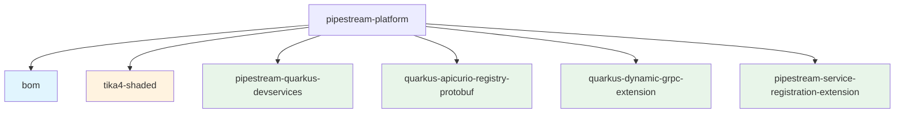

# Pipestream Platform

Monorepo for Pipestream platform libraries - Quarkus extensions, BOM, and utility libraries for the Pipestream AI platform.

## Contents

### Bill of Materials (BOM)

- **pipestream-bom** (`ai.pipestream:pipestream-bom`) - Platform-wide dependency management for all Pipestream projects

### Quarkus Extensions

1. **pipestream-quarkus-devservices** - Dev services for local development
2. **quarkus-apicurio-registry-protobuf** - Apicurio Registry integration with Protobuf
3. **quarkus-dynamic-grpc-extension** - Dynamic gRPC client with service discovery
4. **pipestream-service-registration-extension** - Service registration client

### Utility Libraries

- **tika4-shaded** - Shaded Apache Tika 4 snapshot for Quarkus compatibility

## Structure

This project uses **Gradle composite builds** - each extension/library is its own root project, coordinated from a single repository.



## Versioning Strategy

### Independent Versioning with Axion-Release

Each component has **independent versioning** using [axion-release](https://github.com/allegro/axion-release-plugin):

- **bom**: `bom-v0.6.0`
- **tika4-shaded**: `tika-v0.1.9`
- **devservices**: `devservices-v0.2.0`
- **apicurio**: `apicurio-v0.2.0`
- **dynamic-grpc**: `dynamic-grpc-v0.2.0`
- **service-registration**: `service-registration-v0.2.0`

### How It Works

Axion-release automatically determines versions based on git tags:

- **Tagged**: `git tag devservices-v0.2.0` → version `0.2.0`
- **Untagged**: No tag → version `0.2.0-SNAPSHOT`

The `monorepo` configuration ensures changes to one extension don't affect others' versions.

## Building

### Build All Extensions

```bash
./gradlew buildAll
```

### Test All Extensions

```bash
./gradlew testAll
```

### Build Individual Extension

```bash
cd pipestream-quarkus-devservices
../gradlew build
```

### Check Individual Version

```bash
cd pipestream-quarkus-devservices
../gradlew currentVersion -q
```

### List All Versions

```bash
./gradlew listVersions
```

## Releasing

Use the **Release Extensions** workflow in GitHub Actions:

1. Go to Actions → Release Extensions → Run workflow
2. Select bump type (patch/minor/major)
3. Check which extensions to release (all checked by default)
4. Optionally enable "Dry run" to preview versions
5. Click "Run workflow"

The workflow will:
- Build and verify all selected extensions
- Create git tags for each extension
- Push tags (triggers automatic publishing)

## CI/CD Workflows

- **test.yml** - Runs on push/PR to main, tests all extensions. On push to main, also publishes SNAPSHOTs to Maven Central.
- **release-extensions.yml** - Manual workflow to create release tags
- **publish-extensions.yml** - Triggered by tags, publishes releases to Maven Central + GitHub Packages

## Using the BOM

Import the BOM to manage all Pipestream dependencies:

```groovy
dependencies {
    implementation platform('ai.pipestream:pipestream-bom:0.6.0')

    // Now you can use dependencies without versions
    implementation 'ai.pipestream:pipestream-quarkus-devservices'
    implementation 'ai.pipestream:tika4-shaded'
}
```

## Using SNAPSHOT Versions

To use SNAPSHOT versions in your project, add the Maven Central snapshots repository:

```groovy
repositories {
    maven {
        url = uri('https://central.sonatype.com/repository/maven-snapshots/')
        mavenContent { snapshotsOnly() }
    }
}

dependencies {
    implementation platform('ai.pipestream:pipestream-bom:0.6.0-SNAPSHOT')
}
```

## Git History

This monorepo was created using **git subtree merge** to preserve the full commit history of all individual extensions. You can view the history of each extension:

```bash
git log pipestream-quarkus-devservices/
git log quarkus-apicurio-registry-protobuf/
```

## License

MIT License - See [LICENSE](LICENSE) file for details.
