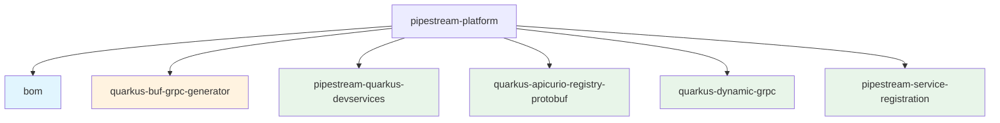

# Pipestream Platform

[](https://github.com/ai-pipestream/pipestream-platform/actions/workflows/test.yml)
[](https://opensource.org/licenses/MIT)

[](https://central.sonatype.com/artifact/ai.pipestream/pipestream-bom)
[](https://central.sonatype.com/artifact/ai.pipestream/pipestream-quarkus-devservices)
[](https://central.sonatype.com/artifact/ai.pipestream/quarkus-apicurio-registry-protobuf)
[](https://central.sonatype.com/artifact/ai.pipestream/quarkus-dynamic-grpc)
[](https://central.sonatype.com/artifact/ai.pipestream/pipestream-service-registration)
[](quarkus-buf-grpc-generator/)

Monorepo for Pipestream platform libraries - Quarkus extensions, BOM, Gradle plugins, and utility libraries for the Pipestream AI platform.

## Contents

### Bill of Materials (BOM)

- **pipestream-bom** (`ai.pipestream:pipestream-bom`) - Platform-wide dependency management for all Pipestream projects

### Gradle Plugins

- **[quarkus-buf-grpc-generator](quarkus-buf-grpc-generator/)** (`ai.pipestream.proto-toolchain`) - Gradle plugin for Protocol Buffer code generation with 100% local execution. Fetch protos from BSR or Git, generate Java/gRPC/Mutiny stubs without uploading data to external servers.

### Quarkus Extensions

1. **pipestream-quarkus-devservices** - Dev services for local development
2. **quarkus-apicurio-registry-protobuf** - Apicurio Registry integration with Protobuf
3. **quarkus-dynamic-grpc** - Dynamic gRPC client with service discovery
4. **pipestream-service-registration** - Service registration client

## Structure

This project uses **Gradle composite builds** - each extension/library is its own root project, coordinated from a single repository.



## Versioning Strategy

### Single Versioning with Axion-Release

All components share a **single version** managed at the root level using [axion-release](https://github.com/allegro/axion-release-plugin):

- All extensions and the BOM use the same version (e.g., `0.7.0`)
- Version is determined from git tags with the `v` prefix (e.g., `v0.7.0`)
- **Tagged**: `git tag v0.7.0` → version `0.7.0`
- **Untagged**: No tag → version `0.7.0-SNAPSHOT`

### How It Works

Axion-release automatically determines the version based on git tags at the repository root. All subprojects inherit this version, ensuring consistent releases across all components.

**Note:** `tika4-shaded` is managed as a separate independent project in its own repository.

## Building

### Build All Extensions

```bash
./gradlew buildAll
```

### Test All Extensions

```bash
./gradlew testAll
```

### Build Individual Extension

```bash
cd pipestream-quarkus-devservices
../gradlew build
```

### Check Current Version

```bash
./gradlew currentVersion -q
```

This will show the current version for all components (they all share the same version).

## Releasing

Use the **Release Extensions** workflow in GitHub Actions:

1. Go to Actions → Release Extensions → Run workflow
2. Select bump type (patch/minor/major)
3. Optionally enable "Dry run" to preview the version
4. Click "Run workflow"

The workflow will:
- Build and verify all extensions
- Create a git tag for the release (e.g., `v0.7.0`)
- Push the tag (triggers automatic publishing of all components)

## CI/CD Workflows

- **test.yml** - Runs on push/PR to main, tests all extensions. On push to main, also publishes SNAPSHOTs to Maven Central.
- **release-extensions.yml** - Manual workflow to create release tags (single tag for all components)
- **publish-extensions.yml** - Triggered by tags, publishes releases to Maven Central + GitHub Packages

## Using the BOM

Import the BOM to manage all Pipestream dependencies:

```groovy
dependencies {
    implementation platform('ai.pipestream:pipestream-bom:0.7.0')

    // Now you can use dependencies without versions
    implementation 'ai.pipestream:pipestream-quarkus-devservices'
    // Note: tika4-shaded is available as a separate dependency from its own repository
    // implementation 'ai.pipestream:tika4-shaded:0.7.0'
}
```


## Using SNAPSHOT Versions

To use SNAPSHOT versions in your project, add the Maven Central snapshots repository:

```groovy
repositories {
    maven {
        url = uri('https://central.sonatype.com/repository/maven-snapshots/')
        mavenContent { snapshotsOnly() }
    }
}

dependencies {
    implementation platform('ai.pipestream:pipestream-bom:0.7.0-SNAPSHOT')
}
```

## Git History

This monorepo was created using **git subtree merge** to preserve the full commit history of all individual extensions. You can view the history of each extension:

```bash
git log pipestream-quarkus-devservices/
git log quarkus-apicurio-registry-protobuf/
```

## License

MIT License - See [LICENSE](LICENSE) file for details.
