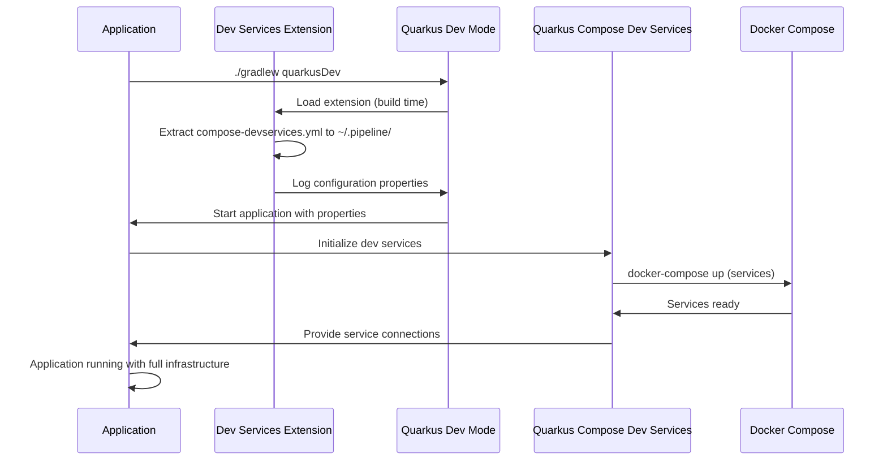

# Quarkus Pipeline Dev Services Extension

This Quarkus extension provides shared development infrastructure services for pipeline microservices. It enables out-of-the-box (OOTB) startup of a complete development environment including PostgreSQL, Consul, Kafka, Apicurio Registry, OpenSearch, MinIO, Redis, and Infisical (for KMS/secret management).

**Important:** This is a development-only feature designed for local microservice development. It provides common infrastructure shared across multiple components to facilitate rapid development workflows. Do not use in production environments.

## Setup

### 1. Add Dependency

Add the extension to your project's `build.gradle`:

```gradle
dependencies {
    // ... other dependencies ...

    // Pipeline Dev Services extension
    implementation 'ai.pipestream:devservices:1.0.0-SNAPSHOT'
}
```

### 2. Configure Application Properties

After adding the dependency, run `quarkus dev` once. The extension will log the required configuration properties to the console. Copy these properties into your `src/main/resources/application.properties`:

Example logged output:
```
To enable Compose Dev Services, add the following properties to your application.properties:
  %dev.quarkus.compose.devservices.enabled=true
  %dev.quarkus.compose.devservices.files=/home/user/.pipeline/compose-devservices.yml
  %dev.quarkus.compose.devservices.project-name=pipeline-shared-devservices
  %dev.quarkus.compose.devservices.start-services=true
  %dev.quarkus.compose.devservices.stop-services=false
  %dev.quarkus.compose.devservices.reuse-project-for-tests=true
```

Add these lines to your `application.properties`:
```properties
# Compose Dev Services - Enable shared infrastructure for dev mode
%dev.quarkus.compose.devservices.enabled=true
%dev.quarkus.compose.devservices.files=${user.home}/.pipeline/compose-devservices.yml
%dev.quarkus.compose.devservices.project-name=pipeline-shared-devservices
%dev.quarkus.compose.devservices.start-services=true
%dev.quarkus.compose.devservices.stop-services=false
%dev.quarkus.compose.devservices.reuse-project-for-tests=true

# Disable Quarkus' built-in datasource devservices
%dev.quarkus.datasource.devservices.enabled=false
```

### 3. Run Application

Execute:
```bash
./gradlew quarkusDev
```

The extension will:
- Extract the Docker Compose file to `${user.home}/.pipeline/compose-devservices.yml`
- Start all shared infrastructure services (PostgreSQL, Consul, Kafka, etc.)
- Your application will connect to these services automatically

## How It Works

### Architecture Overview

The extension uses Quarkus' Compose Dev Services feature to manage containerized infrastructure. It bundles a comprehensive Docker Compose file with all necessary services and extracts it to the user's home directory for execution.

### Service Flow



### Key Components

1. **Extension Build Step** (`PipelineDevServicesProcessor`):
   - Extracts embedded `compose-devservices.yml` from JAR resources
   - Creates version tracking file (`.version`) for updates
   - Logs required Quarkus configuration properties
   - Produces `FeatureBuildItem` for extension registration

2. **Docker Compose File** (`compose-devservices.yml`):
   - Defines all infrastructure services
   - Uses Docker labels for Quarkus service discovery
   - Includes health checks and dependencies
   - Supports volume persistence for data

3. **Quarkus Integration**:
   - `quarkus.compose.devservices.*` properties enable Compose Dev Services
   - Automatic service discovery via Docker labels
   - Runtime connection injection for datasources, messaging, etc.

### Services Provided

| Service | Purpose | Ports | Labels |
|---------|---------|-------|--------|
| PostgreSQL | Primary database | 5432 | `quarkus-dev-service-postgresql: shared` |
| Redis | Caching and Infisical support | 6379 | `quarkus-dev-service-redis: shared` |
| Consul | Service discovery | 8500, 8600 | `quarkus-dev-service-consul: shared` |
| Kafka | Message broker | 9092, 9094 | `quarkus-dev-service-kafka: shared` |
| Apicurio Registry | Schema registry | 8081, 8888 | - |
| OpenSearch | Search engine | 9200, 5601 | `quarkus-dev-service-elasticsearch: shared` |
| MinIO | Object storage | 9000, 9001 | - |
| Infisical | Secret management and KMS | 3000 (UI only) | `quarkus-dev-service-infisical: shared` |
| LGTM Stack | Observability | 3001, 4317, 4318 | `quarkus-dev-service-lgtm: shared` |

### Configuration Options

The extension supports configuration via `application.properties`:

```properties
# Extension settings (optional)
quarkus.pipeline-devservices.enabled=true  # Enable/disable extension
quarkus.pipeline-devservices.target-dir=${user.home}/.pipeline  # Extract location
quarkus.pipeline-devservices.auto-update=true  # Auto-update compose file
quarkus.pipeline-devservices.force-update=false  # Force update even if modified

# Required for Compose Dev Services
%dev.quarkus.compose.devservices.enabled=true
%dev.quarkus.compose.devservices.files=${user.home}/.pipeline/compose-devservices.yml
%dev.quarkus.compose.devservices.project-name=pipeline-shared-devservices

# Infisical Admin Auto-Setup (optional, dev/test only)
# Automatically creates admin account on first startup
%dev.quarkus.pipeline-devservices.infisical.admin-auto-setup=true
%dev.quarkus.pipeline-devservices.infisical.admin-email=admin@pipestream.local
%dev.quarkus.pipeline-devservices.infisical.admin-password=admin-password-change-me

# Test mode - optional
%test.quarkus.pipeline-devservices.infisical.admin-auto-setup=false
```

### Infisical Integration

The extension includes automatic Infisical admin account setup for development and test modes:

- **Automatic Admin Creation**: On first startup, the extension can automatically create an admin account
- **Dev/Test Only**: This feature is **only active in dev and test modes** - it is completely excluded from production builds
- **Configurable**: Enable/disable via `application.properties`
- **Idempotent**: Checks if admin exists before creating (safe to run multiple times)

**Configuration:**
```properties
# Enable admin auto-setup in dev mode
%dev.quarkus.pipeline-devservices.infisical.admin-auto-setup=true
%dev.quarkus.pipeline-devservices.infisical.admin-email=admin@pipestream.local
%dev.pipeline-devservices.infisical.admin-password=admin-password-change-me

# Optional: Customize API URL (defaults to http://infisical:8080)
%dev.quarkus.pipeline-devservices.infisical.api-url=http://infisical:8080
```

**Production Note**: The Infisical admin initialization code is **not included** in production builds. Production deployments should use AWS KMS directly or configure Infisical manually.

### Version Management

The extension tracks compose file versions using SHA-256 hashes:
- Stores version info in `${target-dir}/.version`
- Compares hashes on each run to detect updates
- Preserves user modifications with backup files
- Supports auto-update and force-update modes

### Troubleshooting

- **Services not starting**: Check Docker is running and ports are available
- **Permission issues**: Ensure `${user.home}/.pipeline` is writable
- **Port conflicts**: Services use fixed ports; resolve conflicts manually
- **Database connection failures**: Verify PostgreSQL initialization completed
- **Extension not loading**: Confirm dependency is added and properties are set

### Development Workflow

1. **Initial setup**: Add dependency, run once to get properties, configure `application.properties`
2. **Daily development**: Run `quarkus dev` - infrastructure starts automatically
3. **Multi-service development**: Multiple applications can share the same infrastructure
4. **Data persistence**: Services use named volumes for data retention across restarts
5. **Cleanup**: Services stop automatically when Quarkus dev mode exits

This extension enables zero-configuration microservice development by providing a consistent, shared infrastructure layer.

## Building

```bash
./gradlew build
```

## Publishing

### Snapshots

Snapshots are automatically published to Maven Central Snapshots on every push to main.

### Releases

Releases are triggered by pushing a version tag:

```bash
git tag -a v1.0.0 -m "Release v1.0.0"
git push origin v1.0.0
```

Or via GitHub Actions workflow dispatch.

## License

This project is licensed under the MIT License - see the [LICENSE](LICENSE) file for details.
