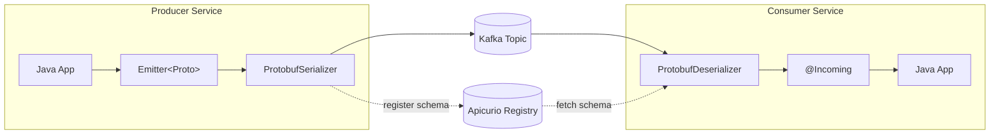
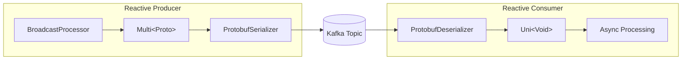

# Quarkus Apicurio Registry Protobuf Extension

A Quarkus extension for seamless Protobuf serialization with Kafka and [Apicurio Registry](https://www.apicur.io/registry/) v3.

This extension **auto-detects Protobuf message types** in your Kafka channels and automatically configures the correct serializers/deserializers - no manual configuration required. It also enforces **UUID keys** for robust partitioning and deduplication.

## Features

- **Zero-config serialization** - Automatically configures `ProtobufKafkaSerializer` and `ProtobufKafkaDeserializer`
- **UUID keys enforced** - All messages use UUID keys via `UUIDSerializer`/`UUIDDeserializer`
- **Schema registry integration** - Auto-registers schemas and derives message classes
- **DevServices** - Apicurio Registry starts automatically in dev/test mode
- **Type-safe messaging** - Full Protobuf type support with generated Java classes
- **Mutiny support** - Works with reactive `Multi<T>` and `Uni<Void>` patterns
- **Native image support** - Works with GraalVM native compilation

## Architecture



## Quick Start (Imperative Style)

This section demonstrates the standard imperative approach using `Emitter` and void consumer methods.

### 1. Add the dependency

```gradle
implementation 'ai.pipestream:quarkus-apicurio-registry-protobuf:0.0.1-SNAPSHOT'
```

### 2. Define your Protobuf message

Create `src/main/proto/orders.proto`:

```protobuf
syntax = "proto3";

package com.example.orders;

option java_package = "com.example.orders.proto";
option java_outer_classname = "OrderProtos";

message Order {
  string order_id = 1; // This will be our UUID key
  string item = 2;
  double price = 3;
}
```

### 3. Implement a Key Extractor (Crucial)

You **must** define how to extract the UUID key from your message if you want to use the simplified `send(message)` method. This bean is auto-discovered.

```java
package com.example.orders;

import ai.pipestream.apicurio.registry.protobuf.UuidKeyExtractor;
import jakarta.enterprise.context.ApplicationScoped;
import java.util.UUID;

@ApplicationScoped
public class OrderKeyExtractor implements UuidKeyExtractor<Order> {

    @Override
    public UUID extractKey(Order order) {
        // Convert the string ID to a UUID
        return UUID.fromString(order.getOrderId());
    }
}
```

### 4. Create a producer

Inject the `ProtobufEmitter` using the `@ProtobufChannel` annotation. This gives you the type-safe, key-aware emitter.

```java
package com.example.orders;

import ai.pipestream.apicurio.registry.protobuf.ProtobufChannel;
import ai.pipestream.apicurio.registry.protobuf.ProtobufEmitter;
import jakarta.enterprise.context.ApplicationScoped;
import jakarta.inject.Inject;
import java.util.UUID;

@ApplicationScoped
public class OrderProducer {

    // 1. Inject the typed emitter. 
    // The extension automatically wires this to the "orders-out" Kafka channel.
    @Inject
    @ProtobufChannel("orders-out")
    ProtobufEmitter<Order> orderEmitter;

    public void createOrder(String id, String item, double price) {
        Order order = Order.newBuilder()
                .setOrderId(id)
                .setItem(item)
                .setPrice(price)
                .build();

        // 2. Send with Implicit Key
        // The extension finds OrderKeyExtractor, extracts the UUID, and sends it as the Kafka Key.
        orderEmitter.send(order); 
    }

    public void rebalanceOrder(UUID newKey, Order order) {
        // 3. Send with Explicit Key (overrides the extractor)
        orderEmitter.send(newKey, order);
    }
}
```

### 5. Create a consumer

Use the standard `@Incoming` annotation. The extension automatically configures the deserializer to handle `Record<UUID, YourProto>`.

```java
package com.example.orders;

import io.smallrye.reactive.messaging.kafka.Record;
import org.eclipse.microprofile.reactive.messaging.Incoming;
import jakarta.enterprise.context.ApplicationScoped;
import java.util.UUID;

@ApplicationScoped
public class OrderConsumer {

    // The extension auto-detects 'Order' type and configures the Protobuf deserializer
    @Incoming("orders-in")
    public void processOrder(Record<UUID, Order> record) {
        UUID key = record.key();
        Order order = record.value();

        System.out.printf("Processing Order [%s]: %s ($%.2f)%n", 
            key, order.getItem(), order.getPrice());
    }
}
```

### 6. Configure application.properties

The extension removes the need for verbose serializer/deserializer config. You mostly just need to point to the Apicurio Registry.

```properties
# 1. Apicurio Registry URL (Required)
# Note: DevServices will set this automatically in dev/test mode.
# In production, point it to your registry instance.
%prod.mp.messaging.connector.smallrye-kafka.apicurio.registry.url=http://localhost:8080/apis/registry/v3

# 2. Configure Topics (Standard SmallRye)
mp.messaging.outgoing.orders-out.topic=orders
mp.messaging.incoming.orders-in.topic=orders

# 3. (Optional) The extension automatically sets these, but you can override them:
# mp.messaging.outgoing.orders-out.value.serializer=io.apicurio.registry.serde.protobuf.ProtobufSerializer
# mp.messaging.incoming.orders-in.value.deserializer=io.apicurio.registry.serde.protobuf.ProtobufDeserializer
```

---

## How It Works (Under the Hood)

This extension performs significant "magic" at build time to simplify your development experience while adhering to Quarkus's build-time optimization philosophy.

1.  **Build Time Scanning**: 
    The extension scans your code for `@ProtobufChannel` injections. For each detected channel (e.g., "orders-out"), it generates a hidden **"Keeper" bean** (`ProtobufChannelKeeper`). 
    
    This Keeper bean explicitly injects the standard SmallRye `MutinyEmitter` for that channel. This is crucial because standard SmallRye logic only creates Kafka channels if it sees them being used. Without this generated Keeper, SmallRye would optimize away the channel as "unused."

2.  **Synthetic Bean Registration**:
    For every `@ProtobufChannel` injection point, the extension registers a **Synthetic Bean** of type `ProtobufEmitter<T>`. This bean acts as a smart wrapper.

3.  **Runtime Wiring**:
    When your application starts, the `ProtobufEmitter` bean is instantiated. It retrieves the underlying `MutinyEmitter` from the generated Keeper bean. This ensures that the emitter you use is fully wired into the Reactive Messaging system.

4.  **Execution Flow**:
    When you call `emitter.send(message)`:
    *   The emitter looks up the registered `UuidKeyExtractor` for your message type.
    *   It extracts the UUID key.
    *   It dispatches a Kafka record with `Key=UUID` and `Value=Protobuf`.
    *   The `ProtobufKafkaSerializer` handles the serialization and schema registration with Apicurio.

---

## Reactive Style with Mutiny

For reactive applications, the extension fully supports Mutiny's `Multi` and `Uni` types. This enables backpressure-aware streaming and non-blocking consumers.



### Mutiny Producer

```java
@ApplicationScoped
public class OrderStreamProducer {

    private final BroadcastProcessor<OrderEvent> processor =
            BroadcastProcessor.create();             // (1) Hot stream source

    @Outgoing("orders-stream")                       // (2) Reactive outgoing channel
    public Multi<OrderEvent> produceOrders() {      // (3) Returns reactive stream
        return processor;                            // (4) Emits when items pushed
    }

    public void send(OrderEvent order) {
        processor.onNext(order);                     // (5) Push to stream
    }

    public void complete() {
        processor.onComplete();                      // (6) Signal end of stream
    }
}
```

1. **BroadcastProcessor** - Hot stream that multicasts items to all subscribers; items pushed via `onNext()`
2. **@Outgoing** - Method return type is the message stream (not `void` like imperative style)
3. **Multi&lt;OrderEvent&gt;** - Extension detects Protobuf in generic type and configures serializer
4. **return processor** - SmallRye subscribes to this Multi and sends each item to Kafka
5. **onNext()** - Push items into the stream; they flow through to Kafka asynchronously
6. **onComplete()** - Signals no more items; use for graceful shutdown

### Mutiny Consumer

```java
@ApplicationScoped
public class OrderStreamConsumer {

    private static final Logger LOG = LoggerFactory.getLogger(OrderStreamConsumer.class);

    private final List<OrderEvent> received = new CopyOnWriteArrayList<>();

    @Incoming("orders-stream-in")                    // (1) Reactive incoming channel
    public Uni<Void> processOrder(OrderEvent order) { // (2) Async acknowledgment
        return Uni.createFrom().item(order)          // (3) Wrap in Uni for composition
                .invoke(o -> {                       // (4) Side-effect processing
                    LOG.info("Processing order: {}", o.getOrderId());
                    received.add(o);
                })
                .replaceWithVoid();                  // (5) Signal completion
    }

    public List<OrderEvent> getReceived() {
        return received;
    }
}
```

1. **@Incoming** - Same as imperative, but method signature differs
2. **Uni&lt;Void&gt; return** - Enables async processing; message acked when Uni completes
3. **Uni.createFrom().item()** - Wraps the message in a reactive pipeline
4. **invoke()** - Performs side effects (logging, storing) without transforming the item
5. **replaceWithVoid()** - Discards the item and signals successful processing; triggers Kafka offset commit

### Mutiny Configuration

```properties
# Reactive channels
mp.messaging.outgoing.orders-stream.connector=smallrye-kafka
mp.messaging.incoming.orders-stream-in.connector=smallrye-kafka
mp.messaging.outgoing.orders-stream.topic=orders-reactive      # (1)
mp.messaging.incoming.orders-stream-in.topic=orders-reactive   # (2)
```

1. **Outgoing topic** - Both channels must use the same topic name
2. **Incoming topic** - Matches outgoing to receive the same messages

### When to Use Mutiny vs Imperative

| Pattern | Use When |
|---------|----------|
| **Emitter (imperative)** | Request-response flows, sending from REST endpoints, simple fire-and-forget |
| **Multi (reactive producer)** | Streaming data sources, event sourcing, continuous data feeds |
| **void return (imperative consumer)** | Simple processing, blocking operations acceptable |
| **Uni return (reactive consumer)** | Async processing, non-blocking I/O, backpressure control |

---

## Configuration Reference

### Auto-configured Properties

The extension automatically sets these properties for detected Protobuf channels:

| Property | Outgoing | Incoming | Description |
|----------|:--------:|:--------:|-------------|
| `key.serializer` | ✓ | | `UUIDSerializer` - enforces UUID keys |
| `key.deserializer` | | ✓ | `UUIDDeserializer` - deserializes UUID keys |
| `value.serializer` | ✓ | | `ProtobufKafkaSerializer` |
| `value.deserializer` | | ✓ | `ProtobufKafkaDeserializer` |
| `auto.offset.reset` | | ✓ | `earliest` |
| `apicurio.protobuf.derive.class` | | ✓ | `true` - derive Java class from registry |
| `apicurio.registry.auto-register` | ✓ | ✓ | `true` - auto-register schemas |
| `apicurio.registry.artifact-resolver-strategy` | ✓ | ✓ | `SimpleTopicIdStrategy` |
| `apicurio.registry.find-latest` | ✓ | ✓ | `true` - use latest schema version |

### Overriding Defaults

All properties can be overridden in `application.properties`:

```properties
# Use a different serializer for a specific channel
mp.messaging.outgoing.orders-out.value.serializer=my.custom.Serializer

# Disable auto-registration for a channel
mp.messaging.outgoing.orders-out.apicurio.registry.auto-register=false

# Use a different artifact strategy
mp.messaging.connector.smallrye-kafka.apicurio.registry.artifact-resolver-strategy=io.apicurio.registry.serde.strategy.TopicIdStrategy
```

### DevServices Configuration

| Property | Default | Description |
|----------|---------|-------------|
| `quarkus.apicurio-registry.protobuf.devservices.enabled` | `true` | Enable/disable DevServices |
| `quarkus.apicurio-registry.protobuf.devservices.image-name` | `apicurio/apicurio-registry:3.1.4` | Container image |
| `quarkus.apicurio-registry.protobuf.devservices.port` | Random | Fixed port (optional) |

### Compose Dev Services

This extension supports [Quarkus Compose Dev Services](https://quarkus.io/guides/compose-dev-services), allowing you to define Apicurio Registry in your own Docker Compose file instead of having the extension start one automatically.

#### How It Works

When you run in dev or test mode, the extension checks for Apicurio Registry in this order:

1. **Existing shared container** - Looks for a dev service container already running with the appropriate label
2. **Compose Dev Services** - Looks for a container with an image containing `apicurio` on port `8080` in your compose file
3. **Auto-start** - Only if neither is found, starts its own Testcontainers-managed Apicurio Registry

#### Using Compose Dev Services

Create a `compose-devservices.yaml` (or `docker-compose-devservices.yaml`) in your project root:

```yaml
services:
  apicurio-registry:
    image: apicurio/apicurio-registry:3.1.4
    ports:
      - "8080"                                          # (1)
    environment:
      QUARKUS_PROFILE: prod
    labels:
      # Optional: map port to Quarkus config property
      io.quarkus.devservices.compose.config_map.port.8080: mp.messaging.connector.smallrye-kafka.apicurio.registry.url  # (2)
```

1. **Expose port 8080** - The extension detects Apicurio by looking for containers exposing port 8080
2. **Config mapping (optional)** - Automatically maps the container's URL to your Quarkus config

#### Benefits of Compose Dev Services

| Feature | Auto DevServices | Compose Dev Services |
|---------|------------------|----------------------|
| **Zero config** | ✓ | Requires compose file |
| **Custom networking** | Limited | Full control |
| **Multiple services** | One per extension | Define your entire stack |
| **Persistent data** | Container restart = data loss | Use volumes for persistence |
| **Custom images** | Via config property | Direct in compose file |
| **Shared across projects** | Via service labels | Via `project-name` |

#### Example: Full Development Stack

```yaml
# compose-devservices.yaml
services:
  kafka:
    image: quay.io/strimzi/kafka:latest-kafka-3.6.0
    command:
      - "sh"
      - "-c"
      - "./bin/kafka-storage.sh format --standalone -t $$(./bin/kafka-storage.sh random-uuid) -c ./config/server.properties && ./bin/kafka-server-start.sh ./config/server.properties"
    ports:
      - "9092"
    environment:
      LOG_DIR: "/tmp/logs"

  apicurio-registry:
    image: apicurio/apicurio-registry:3.1.4
    ports:
      - "8080"
    environment:
      QUARKUS_PROFILE: prod
```

When you run `./gradlew quarkusDev`, Quarkus will:
1. Start your compose services
2. Detect Kafka and Apicurio Registry from the compose project
3. Auto-configure your application to use them
4. Skip starting its own Testcontainers

#### Ignoring Compose Services

If you have an Apicurio Registry in your compose file but want the extension to start its own, add the ignore label:

```yaml
services:
  apicurio-registry:
    image: apicurio/apicurio-registry:3.1.4
    labels:
      io.quarkus.devservices.compose.ignore: "true"     # Extension will start its own
```

## Running in Production

When running outside dev/test mode, you need to provide Kafka and Apicurio Registry:

### Using Docker Compose

```yaml
services:
  kafka:
    image: quay.io/strimzi/kafka:latest-kafka-3.6.0
    command:
      - "sh"
      - "-c"
      - "./bin/kafka-storage.sh format --standalone -t $$(./bin/kafka-storage.sh random-uuid) -c ./config/server.properties && ./bin/kafka-server-start.sh ./config/server.properties"
    ports:
      - "9092:9092"
    environment:
      LOG_DIR: "/tmp/logs"

  apicurio-registry:
    image: apicurio/apicurio-registry:3.1.4
    ports:
      - "8081:8080"
    environment:
      QUARKUS_PROFILE: prod
```

### Production Configuration

```properties
# application.properties
%prod.kafka.bootstrap.servers=kafka:9092
%prod.mp.messaging.connector.smallrye-kafka.apicurio.registry.url=http://apicurio-registry:8080/apis/registry/v3
```

Or via environment variables:

```bash
export KAFKA_BOOTSTRAP_SERVERS=kafka:9092
export MP_MESSAGING_CONNECTOR_SMALLRYE_KAFKA_APICURIO_REGISTRY_URL=http://apicurio-registry:8080/apis/registry/v3
```

## Multiple Topics Example

```properties
# Order events
mp.messaging.outgoing.orders-out.connector=smallrye-kafka
mp.messaging.outgoing.orders-out.topic=orders
mp.messaging.incoming.orders-in.connector=smallrye-kafka
mp.messaging.incoming.orders-in.topic=orders

# Inventory events (different Protobuf type auto-detected)
mp.messaging.outgoing.inventory-out.connector=smallrye-kafka
mp.messaging.outgoing.inventory-out.topic=inventory
mp.messaging.incoming.inventory-in.connector=smallrye-kafka
mp.messaging.incoming.inventory-in.topic=inventory

# Payment events
mp.messaging.outgoing.payments-out.connector=smallrye-kafka
mp.messaging.outgoing.payments-out.topic=payments
```

## Troubleshooting

### Schema not found

If you see `Schema not found` errors, ensure:
1. `apicurio.registry.auto-register=true` is set (default)
2. The producer has sent at least one message to register the schema
3. The registry URL is correct

### Wrong message type

If deserialization returns the wrong type:
1. Verify `apicurio.protobuf.derive.class=true` is set (default)
2. Check that your Protobuf class is on the classpath
3. Ensure the schema in the registry matches your Java class

### DevServices not starting

If Kafka or Registry containers don't start:
1. Verify Docker is running
2. Check `quarkus.apicurio-registry.protobuf.devservices.enabled=true`
3. Ensure `connector=smallrye-kafka` is set for your channels

### Mutiny stream not emitting

If your `Multi` producer isn't sending messages:
1. Verify the `@Outgoing` method is being called (add logging)
2. Check that `BroadcastProcessor.onNext()` is called after subscription
3. Ensure the channel is properly wired in `application.properties`

## Requirements

- Quarkus 3.x
- Java 17+
- Docker (for DevServices in dev/test mode)

## License

MIT License